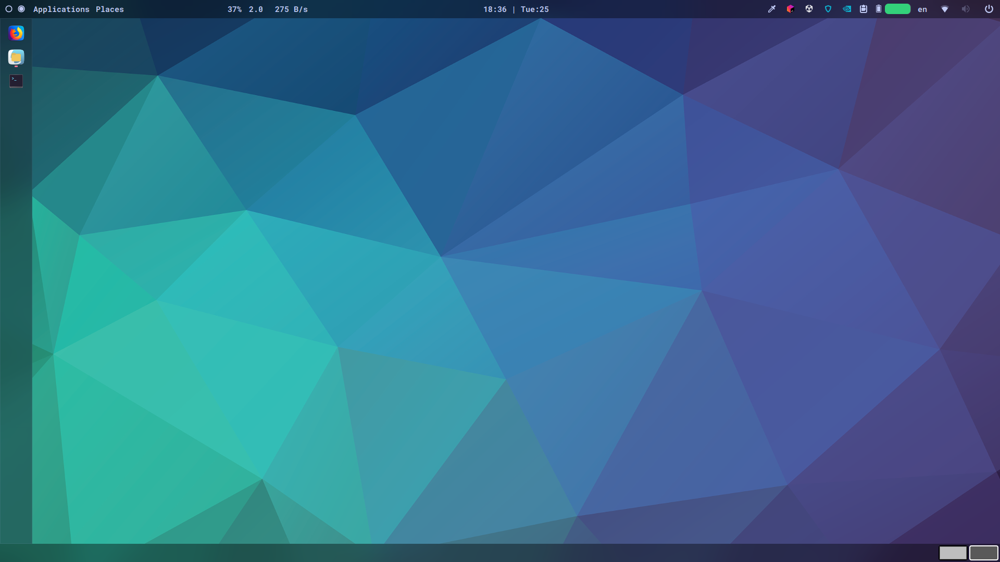
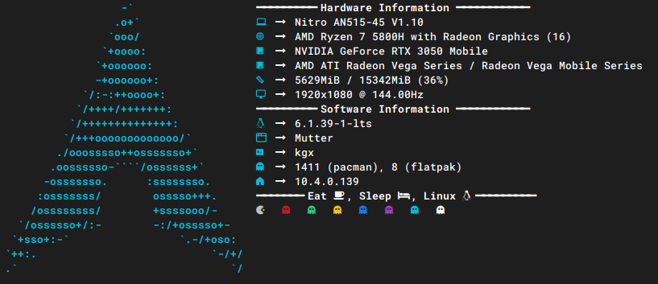
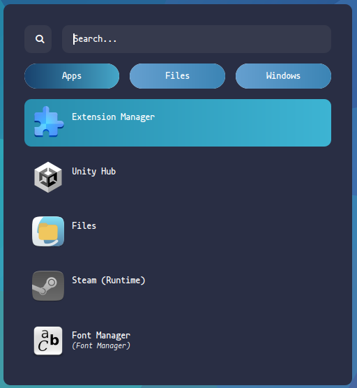
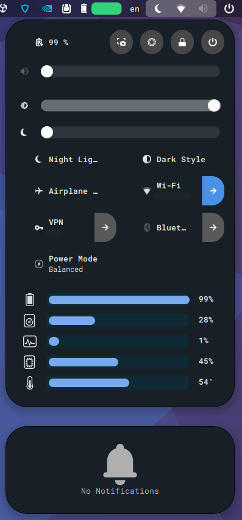
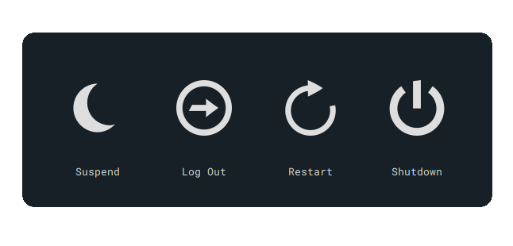
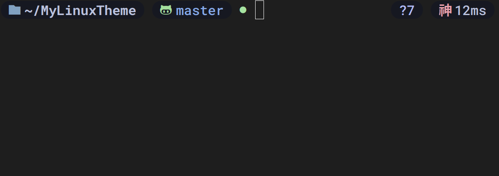

# My arch gnome theme

I personaly use xfce4 but now I'm on gnome.









- [Nerd fonts](https://www.nerdfonts.com/font-downloads)

- GTK Themes: Based on [AestheticStuff by Rxyhn](https://github.com/rxyhn/AestheticStuff)

- GTK Icons:[Papirus icons ](https://www.gnome-look.org/p/1166289)

- [Gnome Shell Extensions](https://extensions.gnome.org/):

  - [Aylur's Widget](https://extensions.gnome.org/extension/5338/aylurs-widgets/): Beautiful Plugins with customizable bar
  - [Blur My Shell](https://extensions.gnome.org/extension/3193/blur-my-shell/): Blur the gnome shell
  - [User Themes](https://extensions.gnome.org/extension/19/user-themes/): Load shell themes from user directories
  - [Color Picker](https://extensions.gnome.org/extension/3396/color-picker/): The simple color picker for gnome shell
  - [Compiz alike magic lamp effect](https://extensions.gnome.org/extension/3740/compiz-alike-magic-lamp-effect/): Magic lamp effect alike the macOS minimize effect
  - [Extension List](https://extensions.gnome.org/extension/3088/extension-list/): A Simple Gnome shell extension manager in the top panel
  - [Just Perfection](https://extensions.gnome.org/extension/3843/just-perfection/): SImple tweak tools to customize the gnome shell and disable some UI Features
  - [Unite](https://extensions.gnome.org/extension/1287/unite/): Remove the title bars of the windows for the minimalist in windows
  - [Vitals](https://extensions.gnome.org/extension/1460/vitals/): A simple system monitor on the top bar
  - [Rounded Window Corners](https://extensions.gnome.org/extension/5237/rounded-window-corners/): Rounded corners for all windows


- First of all install zsh based on your Linux distributions:

- install zsh

- Then install [ohmyzsh](https://ohmyz.sh/) with [Zap](https://www.zapzsh.org/) plugin manager

  - For the prompt im currently using this awesome [StarShip Prompt 🚀](https://starship.rs/guide/#%F0%9F%9A%80-installation) prompt

- Also, if you want the terminal icon install [exa](https://the.exa.website/install)

- Install my prompt:
  - Clone the repos and enter that:
  ```zsh
  git clone https://github.com/0xb4dc0d3x/mylinuxtheme.git
  cd dots/configs/prompt
  ```
  - Copy necessary files:
  ```zsh
  cp starship.toml ~/.config && cp .zshrc $HOME
  ```
  > Then relaunch your terminal then congratulations your beautiful prompt is ready
  - Download then extract it to `~/.fonts`
  - Then run this from the terminal
  ```zsh
  fc-cache -f -v
  ```


